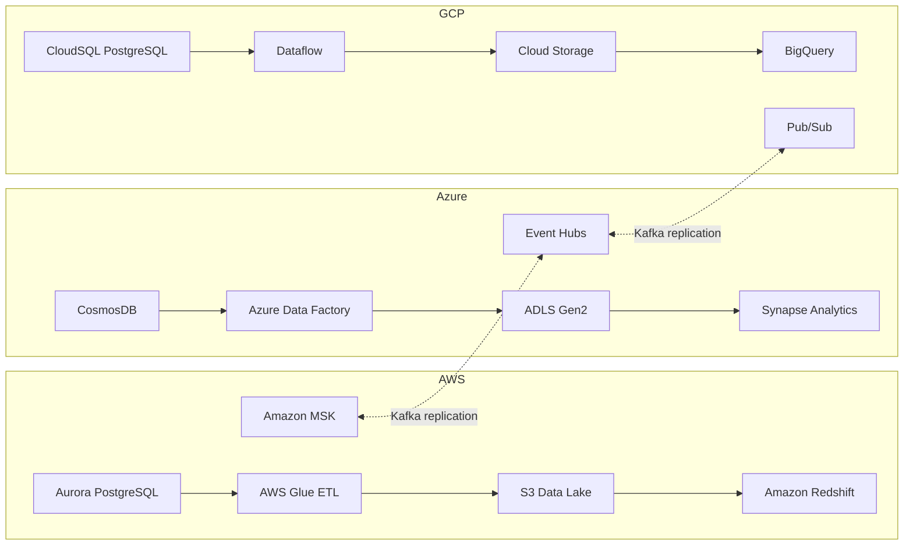

# Terraform Multi-Cloud Data Platform

> **EN**: A production-grade, multi-cloud data platform built with Terraform. Deploys complete data pipelines across AWS, Azure, and GCP with cross-cloud Kafka streaming replication, unified governance, and environment-aware sizing.
>
> **IT**: Una piattaforma dati multi-cloud di livello produttivo costruita con Terraform. Distribuisce pipeline dati complete su AWS, Azure e GCP con replica streaming Kafka cross-cloud, governance unificata e dimensionamento per ambiente.

[](https://github.com/GiulioSavini/terraform-multi-cloud-data-platform/actions/workflows/terraform.yml)
[](LICENSE)

---

## Architecture



Each cloud provider runs a fully independent data pipeline (operational database, ETL engine, data lake, analytics warehouse) while cross-cloud streaming is handled through Kafka-compatible protocols across MSK, Event Hubs, and Pub/Sub.

---

## Features

| Category | Details |
|----------|---------|
| **Multi-Cloud** | Parallel stacks on AWS, Azure, and GCP with consistent module structure |
| **Data Lakes** | S3, ADLS Gen2, and GCS with lifecycle policies and tiered storage |
| **Databases** | Aurora PostgreSQL, CosmosDB (SQL API), CloudSQL PostgreSQL |
| **Analytics** | Redshift, Synapse Analytics, BigQuery |
| **ETL / ELT** | AWS Glue, Azure Data Factory, GCP Dataflow |
| **Streaming** | Amazon MSK, Azure Event Hubs, GCP Pub/Sub with cross-cloud replication |
| **Governance** | Shared governance module for tagging, policies, and audit |
| **Environments** | dev / stg / prd with per-environment sizing and cost controls |
| **Security** | Encryption at rest and in transit, private endpoints, KMS, RBAC |
| **CI/CD** | GitHub Actions with plan-on-PR, auto-apply-on-merge, drift detection |
| **IaC Tooling** | Terraform + Terragrunt, tflint, tfsec, checkov, pre-commit hooks |
| **Docker** | Self-contained workspace image with all CLI tools pre-installed |

---

## Quick Start (One Command)

The fastest way to get the platform running in a development environment:

```bash
git clone https://github.com/GiulioSavini/terraform-multi-cloud-data-platform.git
cd terraform-multi-cloud-data-platform
./scripts/bootstrap.sh dev
```

`bootstrap.sh` performs four steps automatically:

1. **Validates prerequisites** -- checks that Terraform, cloud CLIs, and linting tools are installed (`validate-prereqs.sh`).
2. **Installs pre-commit hooks** -- sets up formatting and security checks on every commit.
3. **Creates remote state backends** -- provisions S3/Azure Blob/GCS buckets for Terraform state (`setup-backend.sh`).
4. **Auto-discovers variables** -- detects cloud account IDs, regions, and project names (`get-variables.sh`).

After the bootstrap completes, review and apply:

```bash
make plan ENV=dev
make apply ENV=dev
```

---

## Manual Setup

### Prerequisites

| Tool | Minimum Version | Purpose |
|------|----------------|---------|
| Terraform | >= 1.7.0 | Infrastructure as Code |
| Terragrunt | >= 0.60.0 | Configuration management and DRY patterns |
| AWS CLI | >= 2.0 | AWS authentication |
| Azure CLI | >= 2.60 | Azure authentication |
| gcloud CLI | >= 494.0 | GCP authentication |
| Docker | >= 24.0 | Workspace container (optional) |
| pre-commit | >= 3.0 | Git hooks for formatting and security |
| tflint | >= 0.53 | Terraform linting |
| tfsec | >= 1.28 | Security scanning |
| checkov | >= 3.0 | Policy-as-code |
| make | >= 4.0 | Build automation |

Run the validation script to confirm everything is installed:

```bash
./scripts/validate-prereqs.sh
```

### Cloud Authentication

1. **AWS** -- IAM user or role with `AdministratorAccess` (or scoped policies). Configure with `aws configure`.
2. **Azure** -- Service principal or user with `Contributor` + `User Access Administrator`. Login with `az login`.
3. **GCP** -- Service account with `Editor` + `Security Admin` roles. Authenticate with `gcloud auth application-default login`.

### Step-by-Step Deployment

```bash
# 1. Clone and enter the repository
git clone https://github.com/GiulioSavini/terraform-multi-cloud-data-platform.git
cd terraform-multi-cloud-data-platform

# 2. Install pre-commit hooks
pre-commit install

# 3. Create remote state backends
./scripts/setup-backend.sh dev

# 4. Populate variables
cp environments/dev/terraform.tfvars.example environments/dev/terraform.tfvars
vim environments/dev/terraform.tfvars

# 5. Initialize Terraform
make init ENV=dev

# 6. Review the execution plan
make plan ENV=dev

# 7. Apply
make apply ENV=dev
```

#### Deployment Order

Deploy modules in this order to satisfy dependencies:

1. **Networking** (all clouds in parallel)
2. **Data Lakes** (S3, ADLS, GCS in parallel)
3. **Databases** (Aurora, CosmosDB, CloudSQL in parallel)
4. **Streaming** (MSK, Event Hubs, Pub/Sub in parallel)
5. **ETL / Processing** (Glue, Data Factory, Dataflow)
6. **Analytics** (Redshift, Synapse, BigQuery)
7. **Governance** (shared module)
8. **Cross-cloud Streaming** (shared module)

---

## Scripts Reference

| Script | Description |
|--------|-------------|
| `scripts/bootstrap.sh` | One-command setup: validates tools, creates backends, discovers variables, and initializes Terraform. Usage: `./scripts/bootstrap.sh [dev\|stg\|prd]` |
| `scripts/validate-prereqs.sh` | Checks that all required CLI tools and minimum versions are installed |
| `scripts/setup-backend.sh` | Creates remote state backends (S3 bucket, Azure Blob container, GCS bucket) for the target environment |
| `scripts/get-variables.sh` | Auto-discovers cloud account IDs, subscription IDs, project names, and regions to populate tfvars |
| `scripts/destroy-all.sh` | Tears down all resources across all three clouds for a given environment in the correct reverse order |

---

## Examples

The `examples/` directory contains self-contained configurations you can use as a starting point or for testing individual stacks.

| Example | Description |
|---------|-------------|
| `examples/complete` | Full multi-cloud deployment with all modules enabled |
| `examples/aws-data-lake` | AWS-only stack: Aurora, Glue, S3, Redshift, MSK |
| `examples/azure-analytics` | Azure-only stack: CosmosDB, Data Factory, ADLS, Synapse, Event Hubs |
| `examples/gcp-bigquery` | GCP-only stack: CloudSQL, Dataflow, GCS, BigQuery, Pub/Sub |
| `examples/streaming` | Cross-cloud streaming replication between MSK, Event Hubs, and Pub/Sub |

---

## Environment Sizing

| Resource | Dev | Staging | Production | Estimated Monthly Cost (prd) |
|----------|-----|---------|------------|------------------------------|
| **Aurora PostgreSQL** | `db.t3.medium` x1 | `db.r6g.large` x2 | `db.r6g.xlarge` x3 (multi-AZ) | ~$1,800 |
| **Redshift** | `dc2.large` x1 | `ra3.xlplus` x2 | `ra3.xlplus` x4 | ~$4,400 |
| **Amazon MSK** | `kafka.t3.small` x2, 100 GB | `kafka.m5.large` x3, 500 GB | `kafka.m5.2xlarge` x3, 2 TB | ~$2,600 |
| **CosmosDB** | 400 RU/s (autoscale) | 1,000 RU/s (autoscale) | 4,000 RU/s (autoscale, 2 regions) | ~$1,500 |
| **Synapse Analytics** | DW100c, Spark Small (3 nodes) | DW200c, Spark Medium (5 nodes) | DW500c, Spark Large (10 nodes) | ~$5,000 |
| **Event Hubs** | Standard, 1 TU | Standard, 2 TU | Standard, 4 TU | ~$400 |
| **CloudSQL PostgreSQL** | `db-custom-2-8192` | `db-custom-4-16384`, 1 replica | `db-custom-8-32768` (HA), 2 replicas | ~$1,200 |
| **BigQuery** | On-demand | On-demand | Flat-rate, 500 slots | ~$10,000 |
| **Dataflow** | `n1-standard-2` x1 | `n1-standard-4` x2 | `n1-standard-8` x4 | ~$1,400 |

> **Note**: Cost estimates are approximate and vary by region, usage patterns, and reserved pricing. Dev environments can be destroyed nightly to minimize cost.

Storage lifecycle policies across all clouds:

| Tier | Dev / Stg | Production |
|------|-----------|------------|
| Warm (IA / Cool / Nearline) | 30 days | 60 days |
| Cold (Glacier / Archive / Coldline) | 90 days | 180 days |

---

## Project Structure

```
terraform-multi-cloud-data-platform/
├── .github/
│   └── workflows/
│       ├── terraform.yml              # Main CI/CD pipeline (validate, plan, apply)
│       └── drift-detection.yml        # Scheduled drift detection
├── environments/
│   ├── dev/                           # Development environment tfvars and config
│   ├── stg/                           # Staging environment tfvars and config
│   └── prd/                           # Production environment tfvars and config
├── modules/
│   ├── aws/
│   │   ├── aurora/                    # Aurora PostgreSQL cluster
│   │   ├── redshift/                  # Redshift data warehouse
│   │   ├── data-lake/                 # S3 Data Lake with lifecycle rules
│   │   ├── glue/                      # Glue ETL jobs and crawlers
│   │   ├── msk/                       # Amazon Managed Streaming for Kafka
│   │   └── networking/                # VPC, subnets, endpoints
│   ├── azure/
│   │   ├── cosmosdb/                  # CosmosDB (SQL API)
│   │   ├── synapse/                   # Synapse Analytics (SQL + Spark pools)
│   │   ├── data-lake/                 # ADLS Gen2 with lifecycle management
│   │   ├── data-factory/              # Azure Data Factory pipelines
│   │   ├── kafka/                     # Event Hubs with Kafka protocol
│   │   └── networking/                # VNet, subnets, private endpoints
│   ├── gcp/
│   │   ├── cloudsql/                  # CloudSQL PostgreSQL
│   │   ├── bigquery/                  # BigQuery datasets and tables
│   │   ├── data-lake/                 # GCS Data Lake with lifecycle rules
│   │   ├── dataflow/                  # Dataflow streaming and batch jobs
│   │   ├── kafka/                     # Pub/Sub topics and subscriptions
│   │   └── networking/                # VPC, subnets, firewall rules
│   └── shared/
│       ├── governance/                # Cross-cloud tagging, policies, audit
│       └── streaming/                 # Cross-cloud Kafka replication
├── scripts/
│   ├── bootstrap.sh                   # One-command setup
│   ├── validate-prereqs.sh            # Tool version checker
│   ├── setup-backend.sh               # Remote state backend provisioning
│   ├── get-variables.sh               # Auto-discover cloud variables
│   └── destroy-all.sh                 # Full teardown across all clouds
├── examples/
│   ├── complete/                      # Full multi-cloud example
│   ├── aws-data-lake/                 # AWS-only example
│   ├── azure-analytics/               # Azure-only example
│   ├── gcp-bigquery/                  # GCP-only example
│   └── streaming/                     # Cross-cloud streaming example
├── terragrunt.hcl                     # Terragrunt root configuration
├── Makefile                           # Build and deployment targets
├── Dockerfile                         # Workspace container image
├── CONTRIBUTING.md                    # Contribution guidelines
├── SECURITY.md                        # Security policy
├── CHANGELOG.md                       # Release history
├── LICENSE                            # MIT License
└── README.md                          # This file
```

---

## Makefile Commands

| Command | Description |
|---------|-------------|
| `make help` | Show all available targets with descriptions |
| `make init ENV=<env>` | Initialize Terraform for the specified environment |
| `make plan ENV=<env>` | Generate and display an execution plan |
| `make apply ENV=<env>` | Apply the previously generated plan |
| `make apply-auto ENV=<env>` | Apply with auto-approve (use with caution) |
| `make destroy ENV=<env>` | Destroy all resources for an environment (requires confirmation) |
| `make fmt` | Format all Terraform files recursively |
| `make validate ENV=<env>` | Validate Terraform configuration |
| `make lint` | Run tflint on all modules |
| `make security` | Run tfsec and checkov security scans |
| `make test` | Run all checks: fmt, validate, lint, security |
| `make clean` | Remove `.terraform/` caches, plan files, and lock files |
| `make output ENV=<env>` | Show Terraform outputs |
| `make state-list ENV=<env>` | List resources in Terraform state |
| `make console ENV=<env>` | Open Terraform interactive console |
| `make graph ENV=<env>` | Generate resource dependency graph (PNG) |
| `make docker-build` | Build the Docker workspace image |
| `make docker-run` | Run the Docker workspace with mounted credentials |
| `make terragrunt-init ENV=<env>` | Initialize with Terragrunt |
| `make terragrunt-plan ENV=<env>` | Plan with Terragrunt |
| `make terragrunt-apply ENV=<env>` | Apply with Terragrunt |

---

## Teardown

To destroy a single environment:

```bash
make destroy ENV=dev
```

To tear down all resources across all three clouds for an environment (in the correct reverse dependency order):

```bash
./scripts/destroy-all.sh dev
```

> **Warning**: Destruction is irreversible. The `destroy` target requires interactive confirmation. Always verify you are targeting the correct environment.

---

## CI/CD Pipeline

The repository includes two GitHub Actions workflows:

### `terraform.yml` -- Main Pipeline

| Stage | Trigger | Description |
|-------|---------|-------------|
| **Validate & Lint** | Push and PR to `main` | Runs `terraform fmt -check`, tflint across all modules |
| **Security Scan** | Push and PR to `main` | Runs tfsec and checkov; uploads SARIF results to GitHub Security |
| **Plan (Dev)** | Push and PR to `main` | Plans against the dev environment; posts plan output as a PR comment |
| **Plan (Prd)** | Push to `main` only | Plans against the production environment |
| **Apply (Dev)** | Push to `main` only | Auto-applies to dev after successful plan |
| **Apply (Prd)** | Push to `main` only | Auto-applies to production after dev succeeds (requires environment approval) |

### `drift-detection.yml` -- Drift Detection

Runs on a schedule to detect configuration drift between the Terraform state and live cloud resources.

### Required GitHub Secrets

| Secret | Description |
|--------|-------------|
| `AWS_ROLE_ARN_DEV` | IAM role ARN for dev (OIDC federation) |
| `AWS_ROLE_ARN_PRD` | IAM role ARN for production (OIDC federation) |
| `AZURE_CLIENT_ID_DEV` | Azure AD app client ID for dev |
| `AZURE_CLIENT_ID_PRD` | Azure AD app client ID for production |
| `AZURE_TENANT_ID` | Azure AD tenant ID (shared across environments) |
| `AZURE_SUBSCRIPTION_ID_DEV` | Azure subscription ID for dev |
| `AZURE_SUBSCRIPTION_ID_PRD` | Azure subscription ID for production |
| `GCP_WIF_PROVIDER_DEV` | GCP Workload Identity Federation provider for dev |
| `GCP_WIF_PROVIDER_PRD` | GCP Workload Identity Federation provider for production |
| `GCP_SA_EMAIL_DEV` | GCP service account email for dev |
| `GCP_SA_EMAIL_PRD` | GCP service account email for production |

---

## Security

### Encryption at Rest

| Cloud | Mechanism |
|-------|-----------|
| AWS | AWS KMS customer-managed keys (CMK) for S3, Aurora, Redshift, MSK |
| Azure | Customer-managed keys in Azure Key Vault for ADLS, CosmosDB, Synapse |
| GCP | Customer-managed encryption keys (CMEK) for GCS, CloudSQL, BigQuery |

### Encryption in Transit

All inter-service and client-to-service communication enforces TLS 1.2 or higher. Cross-cloud Kafka replication uses mutual TLS (mTLS) authentication.

### Network Isolation

- **AWS**: Private subnets, VPC endpoints for S3/Glue/Redshift, security groups with least-privilege rules
- **Azure**: Private endpoints for all PaaS services, NSGs, service endpoints
- **GCP**: Private Google Access, VPC Service Controls, firewall rules

### Identity and Access

- IAM roles follow the principle of least privilege with dedicated service roles per module
- RBAC policies enforce separation between environments (dev/stg/prd)
- OIDC federation for CI/CD -- no long-lived credentials stored in GitHub

### Audit and Compliance

- AWS CloudTrail, Azure Monitor Diagnostic Settings, and GCP Cloud Audit Logs are enabled across all environments
- checkov and tfsec run on every PR to catch misconfigurations before they are deployed

---

## Contributing

Contributions are welcome. Please follow these guidelines:

1. Fork the repository and create a feature branch from `main`.
2. Run `make test` before committing to ensure formatting, validation, linting, and security checks pass.
3. Use [Conventional Commits](https://www.conventionalcommits.org/) (enforced by commitizen).
4. Open a pull request with a clear description of the changes and their motivation.

See [CONTRIBUTING.md](CONTRIBUTING.md) for detailed instructions.

---

## License

This project is licensed under the MIT License. See [LICENSE](LICENSE) for details.
