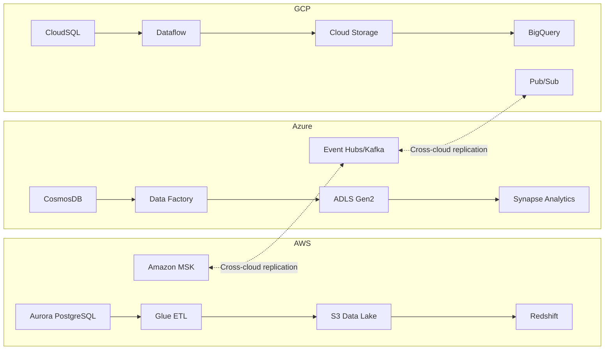

# Multi-Cloud Data Platform / Piattaforma Dati Multi-Cloud

> **EN**: A production-grade, multi-cloud data platform built with Terraform, spanning AWS, Azure, and GCP.
>
> **IT**: Una piattaforma dati multi-cloud di livello produttivo, costruita con Terraform, che si estende su AWS, Azure e GCP.

---

## Architecture / Architettura



## Overview / Panoramica

**EN**: This platform implements a complete data pipeline on each of the three major cloud providers, with cross-cloud streaming replication via Kafka-compatible protocols. Each cloud stack includes:

- **Operational Database** - Aurora PostgreSQL (AWS), CosmosDB (Azure), CloudSQL (GCP)
- **ETL/ELT Engine** - Glue (AWS), Data Factory (Azure), Dataflow (GCP)
- **Data Lake** - S3 (AWS), ADLS Gen2 (Azure), GCS (GCP)
- **Analytics Warehouse** - Redshift (AWS), Synapse Analytics (Azure), BigQuery (GCP)
- **Streaming** - MSK (AWS), Event Hubs (Azure), Pub/Sub (GCP)

**IT**: Questa piattaforma implementa una pipeline dati completa su ciascuno dei tre principali cloud provider, con replica streaming cross-cloud tramite protocolli compatibili con Kafka. Ogni stack cloud include:

- **Database Operazionale** - Aurora PostgreSQL (AWS), CosmosDB (Azure), CloudSQL (GCP)
- **Motore ETL/ELT** - Glue (AWS), Data Factory (Azure), Dataflow (GCP)
- **Data Lake** - S3 (AWS), ADLS Gen2 (Azure), GCS (GCP)
- **Data Warehouse Analitico** - Redshift (AWS), Synapse Analytics (Azure), BigQuery (GCP)
- **Streaming** - MSK (AWS), Event Hubs (Azure), Pub/Sub (GCP)

---

## Prerequisites / Prerequisiti

**EN**: Before deploying, ensure you have the following installed and configured:

**IT**: Prima del deploy, assicurarsi di avere installato e configurato:

| Tool | Version | Purpose / Scopo |
|------|---------|-----------------|
| Terraform | >= 1.7.0 | Infrastructure as Code |
| Terragrunt | >= 0.60.0 | Configuration management / Gestione configurazione |
| AWS CLI | >= 2.0 | AWS authentication / Autenticazione AWS |
| Azure CLI | >= 2.60 | Azure authentication / Autenticazione Azure |
| gcloud CLI | >= 494.0 | GCP authentication / Autenticazione GCP |
| Docker | >= 24.0 | Workspace container (optional / opzionale) |
| pre-commit | >= 3.0 | Git hooks |
| tflint | >= 0.53 | Terraform linting |
| tfsec | >= 1.28 | Security scanning / Scansione sicurezza |
| checkov | >= 3.0 | Policy-as-code |
| make | >= 4.0 | Build automation |

### Cloud Accounts / Account Cloud

**EN**:
1. **AWS**: IAM user or role with `AdministratorAccess` (or scoped policies for each service). Configure with `aws configure`.
2. **Azure**: Service principal or user with `Contributor` + `User Access Administrator` on the subscription. Login with `az login`.
3. **GCP**: Service account with `Editor` + `Security Admin` roles. Authenticate with `gcloud auth application-default login`.

**IT**:
1. **AWS**: Utente IAM o ruolo con `AdministratorAccess` (o policy specifiche per ogni servizio). Configurare con `aws configure`.
2. **Azure**: Service principal o utente con `Contributor` + `User Access Administrator` sulla sottoscrizione. Login con `az login`.
3. **GCP**: Service account con ruoli `Editor` + `Security Admin`. Autenticarsi con `gcloud auth application-default login`.

---

## Quick Start / Avvio Rapido

### Using Docker / Utilizzo con Docker

```bash
# Build workspace image / Costruisci immagine workspace
make docker-build

# Run workspace / Avvia workspace
make docker-run
```

### Direct Deployment / Deploy Diretto

```bash
# 1. Clone the repository / Clona il repository
git clone <repository-url>
cd terraform-multi-cloud-data-platform

# 2. Install pre-commit hooks / Installa gli hook pre-commit
pre-commit install

# 3. Copy and edit tfvars / Copia e modifica tfvars
cp environments/dev/terraform.tfvars.example environments/dev/terraform.tfvars
vim environments/dev/terraform.tfvars

# 4. Initialize / Inizializza
make init ENV=dev

# 5. Review the plan / Rivedi il piano
make plan ENV=dev

# 6. Apply / Applica
make apply ENV=dev
```

### Deployment Order / Ordine di Deploy

**EN**: Deploy modules in this order to satisfy dependencies:

**IT**: Eseguire il deploy dei moduli in questo ordine per soddisfare le dipendenze:

1. **Networking** (all clouds in parallel / tutti i cloud in parallelo)
2. **Data Lakes** (S3, ADLS, GCS in parallel / in parallelo)
3. **Databases** (Aurora, CosmosDB, CloudSQL in parallel / in parallelo)
4. **Streaming** (MSK, Event Hubs, Pub/Sub in parallel / in parallelo)
5. **ETL/Processing** (Glue, Data Factory, Dataflow)
6. **Analytics** (Redshift, Synapse, BigQuery)
7. **Governance** (shared module)
8. **Cross-cloud Streaming** (shared module)

---

## Environment Sizing / Dimensionamento Ambienti

### AWS

| Resource | Dev | Staging | Production |
|----------|-----|---------|------------|
| Aurora Instance | `db.t3.medium` (1 instance) | `db.r6g.large` (2 instances) | `db.r6g.xlarge` (3 instances, multi-AZ) |
| Aurora Backup | 7 days | 14 days | 35 days |
| Redshift Nodes | `dc2.large` x1 | `ra3.xlplus` x2 | `ra3.xlplus` x4 |
| MSK Brokers | `kafka.t3.small` x2 | `kafka.m5.large` x3 | `kafka.m5.2xlarge` x3 |
| MSK Storage | 100 GB | 500 GB | 2000 GB |
| S3 Lifecycle | IA 30d, Glacier 90d | IA 30d, Glacier 90d | IA 60d, Glacier 180d |

### Azure

| Resource | Dev | Staging | Production |
|----------|-----|---------|------------|
| CosmosDB RU/s | 400 (autoscale) | 1000 (autoscale) | 4000 (autoscale) |
| CosmosDB Geo-Replication | Disabled | Disabled | Enabled (2 regions) |
| Synapse SQL Pool | DW100c | DW200c | DW500c |
| Synapse Spark Pool | Small (3 nodes) | Medium (5 nodes) | Large (10 nodes) |
| Event Hubs | Standard, 1 TU | Standard, 2 TU | Standard, 4 TU |
| ADLS Lifecycle | Cool 30d, Archive 90d | Cool 30d, Archive 90d | Cool 60d, Archive 180d |

### GCP

| Resource | Dev | Staging | Production |
|----------|-----|---------|------------|
| CloudSQL | `db-custom-2-8192` | `db-custom-4-16384` | `db-custom-8-32768` (HA) |
| CloudSQL Backup | 7 days | 14 days | 35 days |
| CloudSQL Read Replicas | 0 | 1 | 2 |
| BigQuery | On-demand | On-demand | Flat-rate 500 slots |
| Dataflow Workers | `n1-standard-2` x1 | `n1-standard-4` x2 | `n1-standard-8` x4 |
| GCS Lifecycle | Nearline 30d, Coldline 90d | Nearline 30d, Coldline 90d | Nearline 60d, Coldline 180d |

---

## Project Structure / Struttura del Progetto

```
terraform-multi-cloud-data-platform/
├── .github/workflows/          # CI/CD pipelines
├── environments/
│   ├── dev/                    # Development / Sviluppo
│   ├── stg/                    # Staging / Pre-produzione
│   └── prd/                    # Production / Produzione
├── modules/
│   ├── aws/
│   │   ├── aurora/             # Aurora PostgreSQL
│   │   ├── redshift/           # Redshift cluster
│   │   ├── data-lake/          # S3 Data Lake
│   │   ├── glue/               # Glue ETL
│   │   ├── msk/                # Managed Streaming for Kafka
│   │   └── networking/         # VPC, subnets, endpoints
│   ├── azure/
│   │   ├── cosmosdb/           # CosmosDB (SQL API)
│   │   ├── synapse/            # Synapse Analytics
│   │   ├── data-lake/          # ADLS Gen2
│   │   ├── data-factory/       # Azure Data Factory
│   │   ├── kafka/              # Event Hubs (Kafka protocol)
│   │   └── networking/         # VNet, subnets, private endpoints
│   ├── gcp/
│   │   ├── cloudsql/           # CloudSQL PostgreSQL
│   │   ├── bigquery/           # BigQuery
│   │   ├── data-lake/          # GCS Data Lake
│   │   ├── dataflow/           # Dataflow
│   │   ├── kafka/              # Pub/Sub
│   │   └── networking/         # VPC, subnets, firewall
│   └── shared/
│       ├── governance/         # Cross-cloud governance
│       └── streaming/          # Cross-cloud streaming
├── terragrunt.hcl              # Terragrunt root config
├── Makefile                    # Build targets
├── Dockerfile                  # Workspace image
└── README.md                   # This file / Questo file
```

---

## Security / Sicurezza

**EN**: This platform implements security best practices across all clouds:

**IT**: Questa piattaforma implementa le best practice di sicurezza su tutti i cloud:

- **Encryption at rest** / Crittografia a riposo: KMS (AWS), Customer-managed keys (Azure), CMEK (GCP)
- **Encryption in transit** / Crittografia in transito: TLS 1.2+ everywhere / ovunque
- **Network isolation** / Isolamento di rete: Private subnets, VPC endpoints, Private Link
- **IAM least privilege** / IAM con minimi privilegi: Dedicated roles per service / Ruoli dedicati per servizio
- **Backup & DR** / Backup e Disaster Recovery: Automated backups with configurable retention / Backup automatici con ritenzione configurabile
- **Audit logging** / Log di audit: CloudTrail, Azure Monitor, Cloud Audit Logs

---

## Useful Commands / Comandi Utili

```bash
make help                  # Show all available commands / Mostra tutti i comandi
make init ENV=prd          # Initialize production / Inizializza produzione
make plan ENV=prd          # Plan production changes / Pianifica modifiche produzione
make apply ENV=prd         # Apply production changes / Applica modifiche produzione
make destroy ENV=dev       # Destroy dev environment / Distruggi ambiente dev
make fmt                   # Format all Terraform files / Formatta tutti i file Terraform
make lint                  # Run linter / Esegui linter
make security              # Run security scans / Esegui scansioni sicurezza
make test                  # Run all checks / Esegui tutti i controlli
```

---

## Contributing / Contribuire

**EN**: Please follow these guidelines:
1. Create a feature branch from `main`
2. Run `make test` before committing
3. Use conventional commits (enforced by commitizen)
4. Open a pull request with a clear description

**IT**: Seguire queste linee guida:
1. Creare un branch feature da `main`
2. Eseguire `make test` prima del commit
3. Utilizzare conventional commits (imposto da commitizen)
4. Aprire una pull request con una descrizione chiara

---

## License / Licenza

MIT License - See [LICENSE](LICENSE) for details / Vedi [LICENSE](LICENSE) per dettagli.
